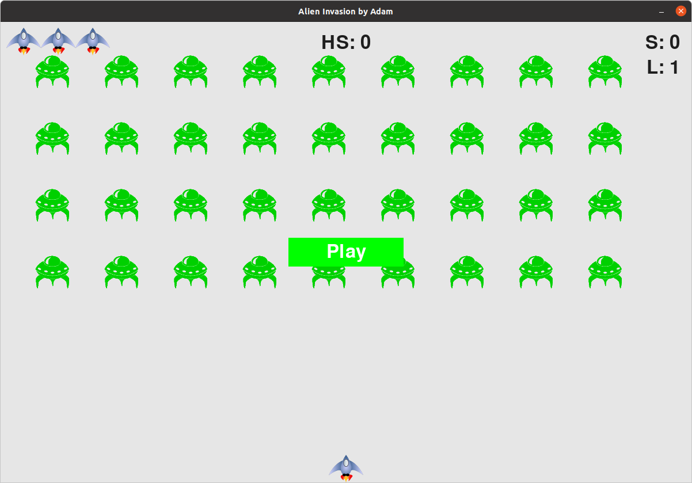

# Alien :alien: Invasion by Adam

## Motivation :bulb:
I wanted to learn more about Python programming, especially about [pygame](https://www.pygame.org/news). 
So, I started to work on this simple video game application based on [Python Crash Course (2nd edition) by Eric Matthes](https://nostarch.com/pythoncrashcourse2e)

## Upgrades :arrow_up:
After the initial game was finished based on the book, some upgrades were added:
* The spaceship can move up and down
* The player can shoot one extra bullet after each 5000 points
* Increased bullet speed after every second level
* A normal alien can become a super alien after it dies by a chance
    * The super alien is three times stronger than a normal alien
* After the entire fleet was destroyed on the current level an alien queen can appear
  * The alien queen is fifteen times stronger than a normal alien
  * The alien queen can fire bullets on the player's spaceship
    * If a bullet hits the ship the player looses one ship
  * After defeating the alien queen the user gets an extra ship
* All-time high score is stored in a file
  * The high score does not reset everytime the user closes the game
  
## Game components and settings :video_game:

In this section the basic game components and settings are summarized.

### Startup screen :computer:
When the player runs the game the startup screen pops up, see below!

On the top left corner, you can see the number of ships (lifes) you have. 
In the middle, you can find the all-time high score (HS). 
On the top right corner, the current score is shown (S).
Below the current score, the current level is shown (L).
In the center of the screen, the play button is shown. If you click on it the game starts!

### Spaceship :rocket:
The spaceship (see below) is located at the bottom-center of the screen.

You can control the spaceship with the following buttons:
* Up arrow: the spaceship flies upwards
* Down arrow: the spaceship flies downwards
* Left arrow: the spaceship flies into the left direction
* Right arrow: the spaceship flies into the right direction
* Space bar: the spaceship fires a bullet
  * At the beginning the player has three bullets
  * The number of bullets increases by one each time the player accomplished 5000 points
  * The bullet speed increases by the game level
  

### Alien fleet :alien:
Basically, the alien fleet consists of normal aliens, see below!

A normal alien dies as it gets hit by bullet shot by the spaceship. 
The alien fleet moves sideways and downwards as any of the aliens hit the side of the screen.
If any alien reaches the bottom of the screen or collides with the spaceship the player looses one ship (life).

### Super alien :space_invader:
When a normal alien is defeated, there is a chance it turns into a super alien, see below!

A super alien is three times stronger than a normal one, so it can be defeated by three bullets.
All the other behaviour of the super alien is similar to the normal alien.

### Alien queen :crown:
When the entire fleet is defeated, there is a chance an alien queen appears, see below!

The alien queen is very strong, it can take fifteen bullet hits before it dies. 
Nonetheless, the alien queen fire bullets to the spaceship. 
If any of these bullets hit the spaceship, the player looses one ship (life).
When the alien queen is defeated the player gets an extra life. 
The player can only five extra ships at the same time.

### Resetting high score :star:
If you wish to reset the all-time high score, then you have to close the game. Then you have to
open the *all_time_high_score.txt* file and replace the current value with zero.

### Changing game settings :memo:
If you wish to change the game settings, making it harder or easier, then you can find
all the settings in the *setting.py* file.

## Running the game :runner:
You can start the game by running the *main.py* file.

The game was tested on [Ubuntu 20.04 (Focal Fossa)](https://releases.ubuntu.com/20.04/).

## Ending the game :end:
You can quit from the game by clicking on the close button at the top right corner of the window.
Or you can hit the *q* button on your keyboard.